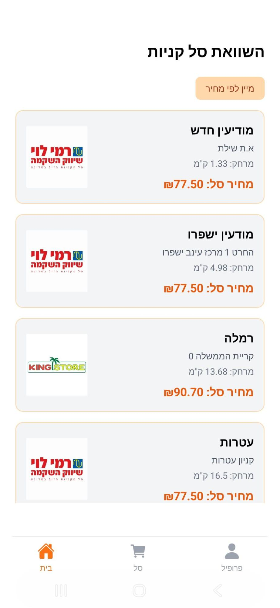
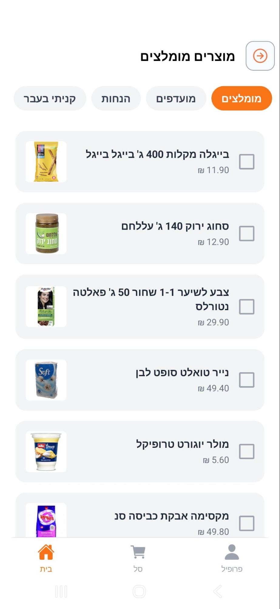
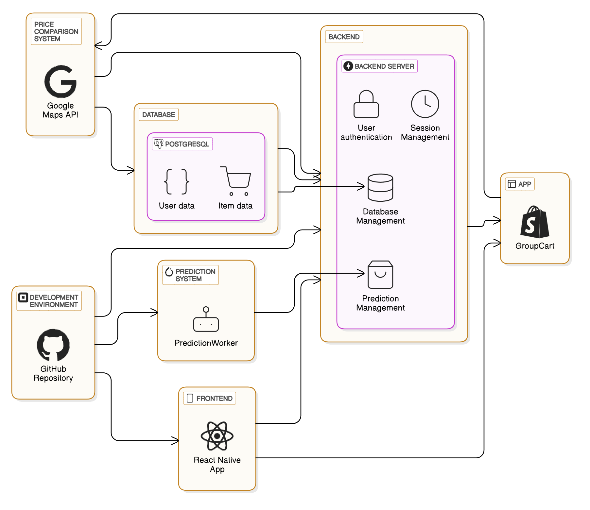

# 🛒 GroupCart – Smart Family Shopping App

GroupCart is a full-stack shopping application designed for families or groups who want to manage a shared shopping cart and receive personalized product recommendations based on collective buying behavior.

The project combines a **FastAPI** backend, **PostgreSQL** database, **web scraping pipeline**, and a **React Native (Expo)** mobile app, with a recommendation system inspired by collaborative filtering.

---

## ✨ Features

### 👨‍👩‍👧‍👦 Family-Based Shopping

- Users can belong to a family/group
- Each family has a shared shopping cart and shared purchase history
- Actions by one member affect the whole family

### 🛍️ Smart Recommendations

Recommendations are generated per family using:

- Purchase frequency
- Recency weighting (recent purchases matter more)
- Cross-family similarity (families with similar behavior)

With automatic filtering of items already in cart and deleted items.

### 🗂️ Store & Product Management

- Products scraped from supermarket chains
- Multiple stores per product
- Price comparison across stores
- Product metadata stored and indexed

### 📱 Mobile App (React Native + Expo)

- Authentication (JWT)
- Browse products
- Add/remove items from family cart
- Like products
- View personalized recommendations
- Expo Go / Development build support

---

## 🏗️ Tech Stack

| Layer | Technology |
|---|---|
| Backend | FastAPI, SQLAlchemy ORM, Pydantic, Alembic, JWT |
| Database | PostgreSQL |
| Testing | Pytest |
| Frontend | React Native, Expo, TypeScript, NativeWind, Axios |
| Data Pipeline | Selenium, Requests, XML parsing |

---

## ⚙️ Setup

### Backend

```bash
cd backend
python -m venv venv
source venv/bin/activate  # Windows: venv\Scripts\activate
pip install -r requirements.txt
```

Configure your database and environment variables, then:

```bash
alembic upgrade head
uvicorn main:app --reload
```

Backend will be available at `http://localhost:8000`.

### Frontend

```bash
cd frontend
npm install
npx expo start
```

Options:
- Run on Android emulator
- Run on physical device via Expo Go
- Use Expo tunnel for external access

---

## 🧪 Testing

```bash
pytest
```

Test coverage includes:

- User authentication
- Family logic
- Cart operations
- Recommendation endpoints

---

## 🚀 Future Improvements

- [ ] Real-time cart syncing
- [ ] Product category ML classifier *(WIP)*
- [ ] Better cold-start recommendations
- [ ] Admin dashboard
- [ ] Notifications

---

## 📌 Notes

- Developed as a full-stack academic project
- Focus placed on architecture, data modeling, and recommendation logic
- Designed to be extensible and production-oriented

---

## 🖼️ Screenshots

### 🏠 Home Screen
Browse products by category with personalized discount badges and a clean product grid.



### 🛒 Shopping Cart
View all items added by family members, see who added each item, undo/redo changes, and compare prices across stores.



### ✨ Smart Recommendations
AI-powered product suggestions filtered into tabs — Recommended, Favorites, Discounts, and Past Purchases.


### 📦 Product Page
Detailed product view with pricing, nearby store availability, and distance — tap to add directly to the family cart.



### 🗺️ Cart Price Comparison
Compare the total cost of your cart across nearby supermarket branches, sorted by price.


### 👤 Profile & Settings
Manage your account, view family members, and configure your search radius for nearby stores.


### 🏗️ System Architecture
High-level architecture diagram showing the interaction between the React Native app, FastAPI backend, PostgreSQL database, prediction system, and Google Maps integration.


---

## 👤 Author

**Itay Ben Daniel**
